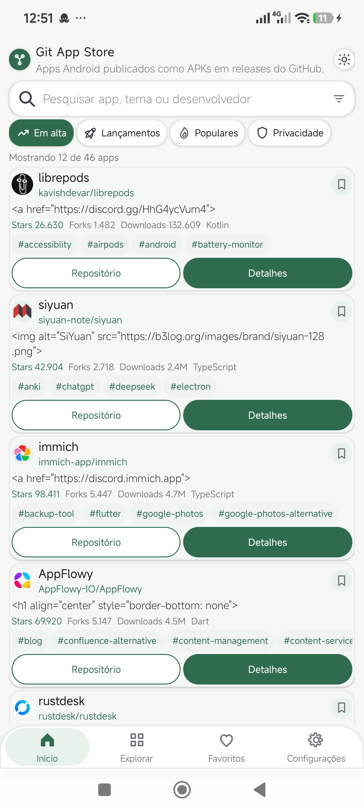
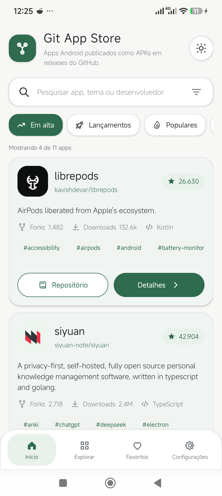
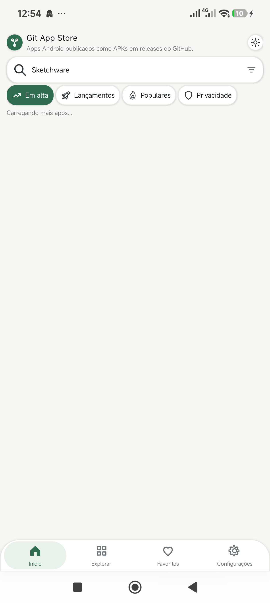

# Git App Store

Git App Store e um aplicativo Android que descobre projetos open source no GitHub e destaca repositorios com APKs publicados nas releases. A ideia e navegar por apps Android distribuidos fora da Play Store, explorar detalhes do projeto, baixar APKs e acompanhar atualizacoes dos favoritos.

## Destaques

- Feed inicial com apps Android encontrados a partir da API e de fontes auxiliares.
- Busca por nome do app, repositorio, tema ou desenvolvedor.
- Pagina de detalhes mais rica com release notes, topicos, colaboradores e links para o GitHub.
- Screenshots extraidas do README em grid com abertura dentro do proprio app.
- README expandido para exibir mais contexto do projeto sem sair da interface.
- Lista de APKs por release com download, leitura de permissoes e acao para instalar depois do download.
- Favoritos com notificacao de novas releases.
- Analytics com Firebase para eventos principais do fluxo.
- Sistema de temas com opcoes claras, escuras e variantes AMOLED.

## Temas incluidos

O app mantem os temas anteriores e agora inclui mais opcoes otimizadas para telas AMOLED:

- Sistema
- Claro
- Preto AMOLED
- AMOLED Black
- AMOLED Blue
- AMOLED Pink
- AMOLED Emerald
- AMOLED Violet
- AMOLED Orange
- AMOLED Gold
- AMOLED Ruby
- AMOLED Cyan
- AMOLED Graphite

## Stack

- Android Views com Kotlin
- RecyclerView e Material Components
- Firebase Analytics
- Consumo de APIs do GitHub
- Gradle Kotlin DSL

## Requisitos

- Android Studio atualizado
- JDK 11
- Android SDK com `compileSdk 36`
- `minSdk 24`

## Como executar

1. Clone o repositorio.
2. Abra o projeto no Android Studio.
3. Sincronize o Gradle.
4. Execute `./gradlew assembleDebug` ou rode pelo Android Studio.

Se voce quiser usar um projeto Firebase proprio, troque o arquivo `app/google-services.json` antes de gerar sua build.

## Estrutura principal

- `app/src/main/java/com/saas/payment/gitappstore/MainActivity.kt`: feed principal, busca, navegacao e configuracoes.
- `app/src/main/java/com/saas/payment/gitappstore/DetailActivity.kt`: pagina detalhada do app, releases, README, screenshots e APKs.
- `app/src/main/java/com/saas/payment/gitappstore/ScreenshotViewerActivity.kt`: visualizador interno de imagens do README.
- `app/src/main/java/com/saas/payment/gitappstore/ThemeManager.kt`: catalogo e persistencia dos temas.
- `app/src/main/java/com/saas/payment/gitappstore/data/GitHubStoreApi.kt`: integracao com GitHub, leitura de README, imagens e releases.

## Capturas de tela

### Home



### Navegacao



### Visual refinado



## Validacao

Build local validada com:

```bash
./gradlew assembleDebug
```

Instalacao em aparelho fisico validada via ADB durante o desenvolvimento.

## Licenca

Este projeto pode ser publicado com a licenca que voce preferir. Se quiser, no proximo passo eu posso adicionar um arquivo `LICENSE` tambem.
